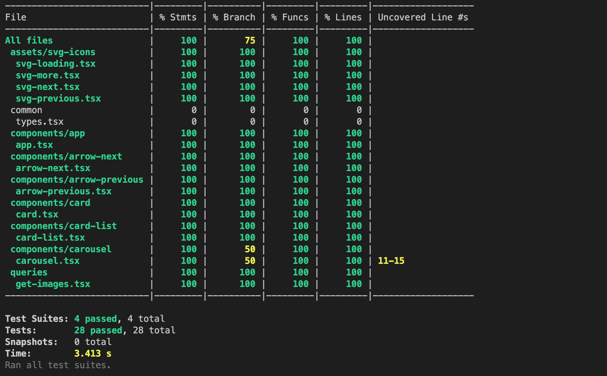

## Clone du projet

```
git clone https://github.com/juvatsana/interview
```

## Build de l'application

```
cd tf1-interview
npm run build
```

## Lancement de l'application

```
serve -s build
```

---

# Résultats

## Chargement des données


## Rendu carousel


## Tests unitaires & Couverture de code



```
npm test -- --coverage
```

# Points d'attention

- Aucune librairie externe utilisée pour le carousel, codé from scratch

- Boucle infinie sur les éléments du carousel

- Icône de chargement ajoutée lors du fetch des données

- Taille des icônes ajustées en fonction de la taille du device

- Haute couverture de code des tests unitaires

# Quelles sont les problématiques ou remarques sur le test ?

## Spécifications manquantes

- Faut-il avancer d'un élément, de plusieurs ou du nombre d'éléments affichés ?

- Quel est le comportement souhaité en bout de liste du carousel ?

- Blocage sur le premier et dernier élément ?

- Boucle infinie sur les éléments ?

- Combien d'éléments fetcher dans le carousel ?

- Faut-il fetcher plus ou moins d'éléments en fonction de la taille de l'écran ?

- Faut-il ajouter une animation lors du défilement des éléments ?

- Faut-il utiliser la pagination fournie par l'api ?

- Gestion des erreurs, que faire si l'image est non disponible ?

- Afficher une image par default ? Afficher "Image non disponible" ? Ne pas afficher l'élément ?

- Maquettes manquantes pour chacun des formats mobile, tablette, pc...

_A mon sens il manque des maquettes pour chacun des devices, j'ai supposé que ce besoin était pour l'application tf1 replay, si c'est le cas l'application est utilisée par un grand nombre d'utilisateurs provenant de divers devices. Il est donc primordial de prévoir tous les breakpoints possibles, et d'expliquer clairement le comportement souhaité._

- Manque important de documentation concernant l'api GraphQl

- Il me semble également qu'il y a des problèmes dans les données (program,thumnail en boucle)

_Si j'aurais été en charge de ce développement, j'aurais demandé des explications précises sur les données et quelles sont clairement les éléments des données à utiliser pour le carousel._

## Points négatifs

- Correction un peu rapide du problème des images non existantes (/vvvignette et /vvignette)

- Je suis passé un peu trop rapidement sur le format des données remontés par GraphQl

_Du fait du manque de documentation, j'ai fait un peu simple en récupérant uniquement les images(url et alt) mais cela aurait été plus pertinent de récupérer les programmes avec leur thumbail (et non thumnail) et d'utiliser le système de pagination offert par l'api._

```
  program(limit: 20, offset: 0) {
    id
    name
    thumnail {
      url
      alt
    }
  }
```

# Axes d'amélioration

- Mise en place du Server Side Rendering en utilisant Next.js (getServerSideProps) par exemple pour optimiser la récupération des données

- Définir les différents breakpoints de l'application et définir le nombre d'éléments à afficher et les tailles des éléments en fonction de la taille de l'écran

- Effectuer des corrections sur les données remontées par GraphQl, et mettre en place une documentation des APIs

# En l'état, pourrait-il mettre en production son travail ?

Evidement non pour toutes les raisons citées plus haut,

- Manque de spécifications sur le comportement attendu du carousel

- Manque d'informations sur l'aspect responsive du composant

- Manque d'informations sur la gestion des erreurs

- Manque d'informations concernant la data récupérée

- Correction nécessaire sur les données remontées par GraphQl

- Correction rapide sur les images non-récupérables, solution non-performante.

- Manque de tests d'intégrations avec les autres composants de l'application.

PS: J'ai trouvé le test très intéressant et complet, félicitations aux personnes l'ayant préparé.

Au plaisir d'échanger ensemble,
Julien
